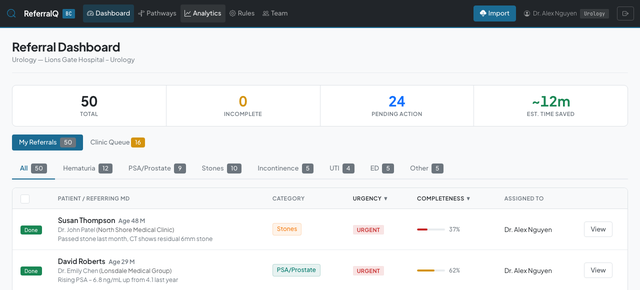
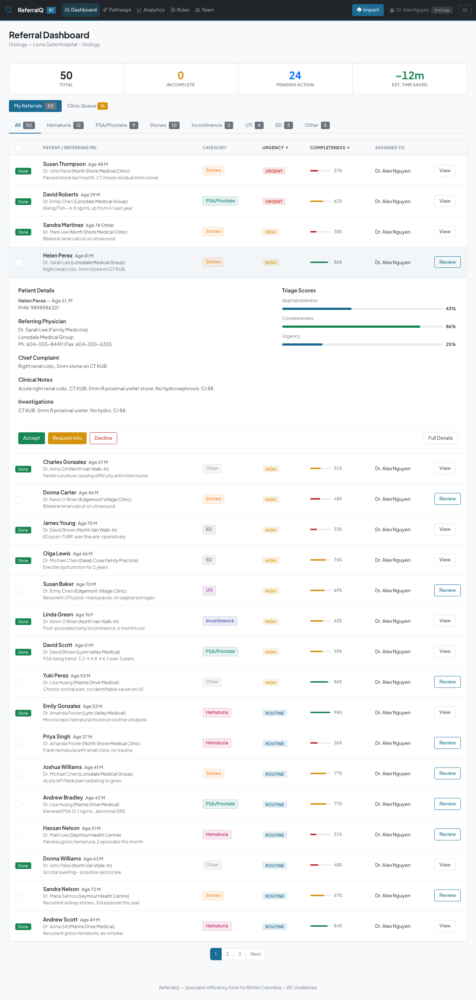
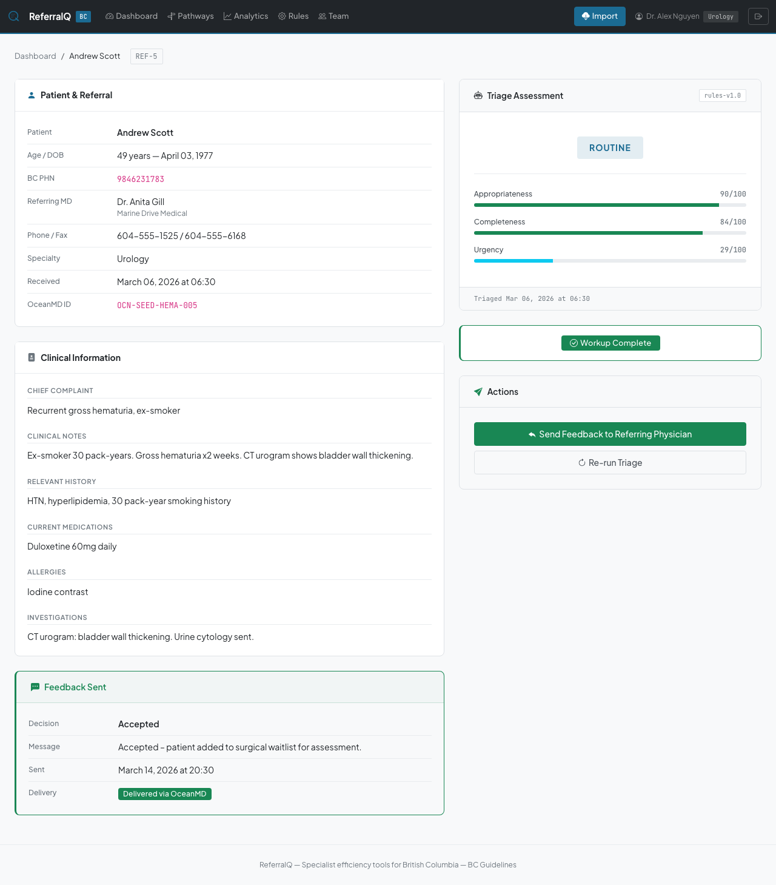
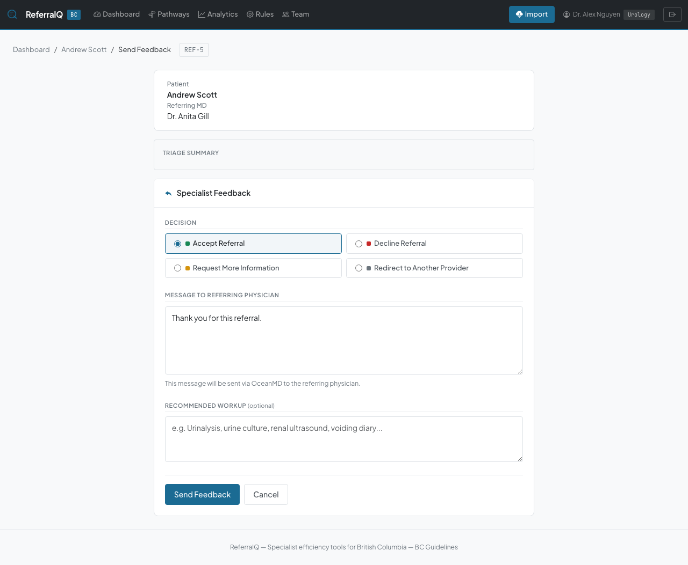
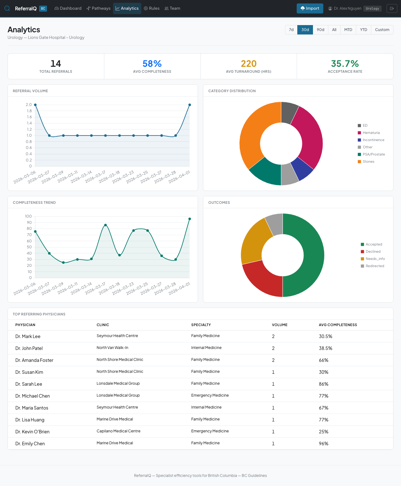
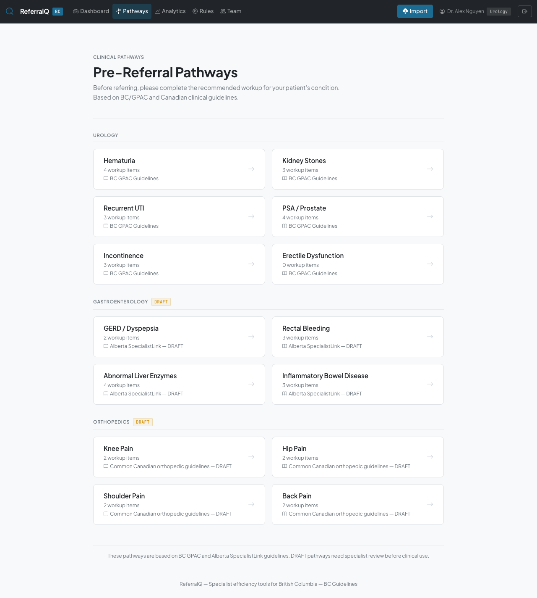

# ReferralQ

An exploratory prototype for triaging specialist referrals in the Canadian healthcare system, starting with BC urology.

**Rohit Singla**, rsingla@ece.ubc.ca, [LinkedIn](https://www.linkedin.com/in/rsingla92/)

This is a research prototype, not a live product. It has not been deployed to a real clinic and has not processed a real patient referral. Everything described below runs on seeded, synthetic data.



## Table of contents

- [Current state](#current-state)
- [How this project came about](#how-this-project-came-about)
- [What this project is](#what-this-project-is)
- [Architecture](#architecture)
- [Why it is designed this way](#why-it-is-designed-this-way)
- [Why the results look the way they do](#why-the-results-look-the-way-they-do)
- [Screenshots](#screenshots)
- [Running it](#running-it)
- [Configuration](#configuration)
- [Test suite](#test-suite)
- [Installation](#installation)
- [How I built this, and what I learned](#how-i-built-this-and-what-i-learned)
- [Read these files first](#read-these-files-first)

## Current state

<details>
<summary><strong>7 features built, 146 tests passing, no real-world use yet</strong> (click to expand)</summary>

**Built:** a rule-based triage engine (appropriateness/completeness/urgency scoring) with a Claude Haiku fallback; DB-backed clinical rules for Urology, Gastroenterology, and Orthopedics; a specialist dashboard with category queues, inline review, and batch actions; public no-login pre-referral pathway pages; an analytics dashboard; multi-user clinic management; and a mock OceanMD e-referral client.

**Verified:** 146 tests passing, `mypy` and `ruff` both clean. No CI enforces this yet, it's checked locally.

**Not yet verified:** no real clinic or physician has used this on a live referral, all data is synthetic. The live OceanMD API path is untested. Urology's rules are grounded in BC's [GPAC](https://www2.gov.bc.ca/gov/content/health/practitioner-professional-resources/bc-guidelines) guidelines; Gastroenterology and Orthopedics are drafts with less clinical review. The LLM fallback has no accuracy evaluation against ground truth.

</details>

## How this project came about

I'm a physician who works directly with specialists, including urologists, and I've seen how much of a referral triage backlog comes down to incomplete information rather than clinical complexity: a referral sits in a queue because it's missing a PSA value or a urinalysis, not because the specialist can't make a decision. I wanted to know:

- Whether a rule-based scoring system, informed by the same guidelines (GPAC) that specialists already use to decide what's appropriate, could flag that gap automatically and tell the referring physician exactly what's missing before the referral ever reaches a human queue.
- What was actually possible to build on top of OceanMD, the e-referral platform most BC physicians already use to send referrals. I was curious what its API exposed and whether a triage layer could sit on top of the existing referral flow without asking physicians to change how they refer.

## What this project is

A Flask application that ingests referrals (from OceanMD or a local mock), runs them through a rule-based triage engine, and produces an appropriateness score, a completeness score, an urgency score, and a list of specifically missing information. Specialists see the scored referrals in a dashboard with category filters and batch actions. Family physicians get a public, no-login pathway page per condition that tells them what workup to complete before referring at all.

Referrals that don't match any keyword rule (roughly 10-20% in testing) fall back to a Claude Haiku classification call rather than defaulting to "other." The clinical rules themselves (keywords, required fields, workup items, pathway text) live in the database and are editable from an admin UI, not hardcoded, so a specialist can tune them without a code change.

## Architecture

```
                                   ┌──────────────────────┐
                                   │   Family physician    │
                                   │  (via OceanMD e-ref)  │
                                   └───────────┬──────────┘
                                               │ referral
                                               ▼
                              ┌────────────────────────────────┐
                              │      OceanMD e-referral API      │
                              │  (mock in dev / untested live)   │
                              └───────────────┬──────────────────┘
                                              │ fetch_pending_referrals()
                                              ▼
                    ┌──────────────────────────────────────────────────┐
                    │                 Triage engine                     │
                    │  keyword rules (GPAC-informed) ─┬─ appropriateness │
                    │                                  ├─ completeness    │
                    │                                  ├─ urgency         │
                    │  no keyword match ──────────────►│  Claude Haiku    │
                    │                                   │  fallback (LLM) │
                    └───────────────────┬────────────────────────────────┘
                                        │ TriageResult
                                        ▼
        ┌───────────────────────────────────────────────────────────────┐
        │                         PostgreSQL / SQLite                    │
        │   Specialty → ClinicalCategory → WorkupItem/Keyword/Priority    │
        │   Clinic → User → Referral → TriageResult → Feedback           │
        └──────────────┬───────────────────────────────┬─────────────────┘
                        │                               │
                        ▼                               ▼
        ┌───────────────────────────┐   ┌──────────────────────────────┐
        │   Specialist dashboard     │   │  Public pre-referral pathway  │
        │  queue, quick review,      │   │  pages (no login required)    │
        │  batch actions, analytics  │   │  for family physicians        │
        └───────────────────────────┘   └──────────────────────────────┘
```

## Why it is designed this way

**Rules first, LLM as fallback, not the reverse.** An LLM call for every referral is unnecessary cost and an unnecessary point of non-determinism for a decision that a keyword match usually resolves correctly and explainably. The engine only calls Claude Haiku when the keyword rules don't produce a category, at roughly $0.01 per call, which keeps the primary decision path auditable: a specialist can see exactly which keyword matched and why a referral scored the way it did.

**Missing information over binary accept/reject.** Early on, an appropriateness score alone told a specialist a referral looked reasonable but not what was missing to act on it (see `_REQUIRED_FIELDS_UROLOGY` and `_STRONGLY_RECOMMENDED_UROLOGY` in `triage_engine.py`). The engine tracks required fields and strongly-recommended investigations separately from the appropriateness score and surfaces them as a `missing_information` list, so the feedback sent back to the referring physician says "add a urinalysis and PSA" instead of just a number.

**Rules live in the database, not in code.** The first version hardcoded Urology's keywords directly in `triage_engine.py`. That doesn't scale to a second specialty without a code deploy every time a specialist wants to add a keyword. Clinical rules (`ClinicalCategory`, `WorkupItem`, `PriorityKeyword`, `PathwayGuidance`) are now DB-backed and editable from `/admin`, with the original hardcoded lists kept only as a fallback for when no DB ruleset exists yet.

**Mock the external dependency, not the internal logic.** `OceanMDService` mocks the OceanMD API surface (`fetch_pending_referrals`, `send_feedback`) behind the same interface used in production, switching to mock mode automatically when `OCEAN_MD_API_KEY` is unset. That let the triage engine, dashboard, and analytics be built and tested end-to-end without ever needing a live OceanMD credential, at the cost of never having verified the real integration.

## Why the results look the way they do

The triage engine outputs three separate 0-100 scores rather than one composite number, because appropriateness, completeness, and urgency answer different questions for different readers. A specialist deciding priority order cares about urgency. A referring physician trying to fix their submission cares about completeness. Collapsing those into one score would hide which one is driving a low result.

Recommended priority (`routine`, `soon`, `urgent`) is derived from urgency keyword hits, not from the composite score, so a referral with a red-flag term like "testicular torsion" is flagged urgent even if other fields are incomplete. Completeness deductions are itemized (`_REQUIRED_FIELD_PENALTY`, `_INVESTIGATION_PENALTY`) rather than a single missing-fields count, so the `missing_information` list can be sent back to the referring physician verbatim.

## Screenshots

<details>
<summary><strong>Landing page: trust signals and CTA for specialist physicians</strong></summary>


</details>

<details>
<summary><strong>Inline quick review: accept/decline without leaving the table</strong></summary>

Click a row to expand patient details and triage scores; act via AJAX with no page navigation.



</details>

<details>
<summary><strong>Referral detail: full clinical view with triage assessment panel</strong></summary>

Patient demographics, referring physician info, clinical notes, and missing-workup detection.



</details>

<details>
<summary><strong>Feedback form: auto-populated from the triage result</strong></summary>

Decision pre-selected, message pre-filled from category-specific templates, recommended workup pulled from missing information.



</details>

<details>
<summary><strong>Analytics: volume trends, completeness, and outcomes</strong></summary>

Time frame picker (MTD/YTD/custom range), top referring physicians by clinic and specialty.



</details>

<details>
<summary><strong>Pre-referral pathways: public, no-login workup checklists for family physicians</strong></summary>

Condition-specific, grouped by specialty, based on GPAC guidelines where available.



</details>

The full set (12 screenshots, including admin rules, settings, and mobile layout) is in [`docs/screenshots/`](docs/screenshots/README.md).

## Running it

**Interactive (local dev server)**

```bash
python3 -m venv venv && source venv/bin/activate
pip install -r requirements.txt
flask --app run.py db upgrade
flask --app run.py seed-specialty   # 3 specialties with clinical rules
flask --app run.py seed-demo        # demo clinic + specialist account
flask --app run.py seed-templates   # response templates
python run.py
```

Then open `http://127.0.0.1:5000` and log in with the credentials printed by `seed-demo`.

**Automated (tests)**

```bash
python -m pytest -v
```

**Individual tools**

```bash
flask --app run.py seed-referrals   # load additional mock OceanMD referrals
mypy .                              # type check
ruff check .                        # lint
```

## Configuration

Copy `.env.example` to `.env` and set:

| Variable | Description |
|----------|-------------|
| `SECRET_KEY` | Flask secret key (required in production) |
| `DATABASE_URL` | SQLAlchemy DB URL (default: SQLite) |
| `OCEAN_MD_API_KEY` | OceanMD API key (empty = mock mode) |
| `OCEAN_MD_BASE_URL` | OceanMD API base URL |
| `ANTHROPIC_API_KEY` | Anthropic API key (optional, enables the Claude Haiku classification fallback) |

## Test suite

```bash
python -m pytest -v
```

146 tests: `test_triage_engine.py` (45, classification/workup/scoring/LLM/ruleset), `test_ocean_md.py` (12, mock mode and live-API parsing), `test_routes.py` (68, auth/dashboard/batch/clinic/analytics/pathways), `test_fixes.py` (21, regression tests for QA-discovered bugs). No CI is configured; these run locally.

## Installation

```bash
git clone git@github.com:rsingla92/specialisttriage.git
cd specialisttriage
python3 -m venv venv && source venv/bin/activate
pip install -r requirements.txt
cp .env.example .env
```

Python 3.11, Flask 3.1, SQLAlchemy 2.0.

## How I built this, and what I learned

**What I owned**: the clinical logic (which fields are required, which keywords indicate urgency, how completeness should be scored), the decision to separate appropriateness/completeness/urgency instead of one composite score, the choice to make LLM classification a fallback rather than the primary path, and the call on which specialty's rules were mature enough to ship (Urology) versus draft (Orthopedics).

**What AI accelerated**: route and model boilerplate, test generation for the routes and regression suite, the Bootstrap/Chart.js frontend, and refactoring the hardcoded Urology keyword lists into the DB-backed rule system once the schema was decided.

**Lessons learned**:
- Keyword-rule triage is legible in a way an LLM-only approach isn't: when a referral scores low, `missing_information` points at the exact field, which matters when the output goes back to a referring physician who needs to act on it, not just a probability.
- Moving clinical rules from hardcoded Python lists to database rows was more work than the triage logic itself. It touched the seed scripts, the admin UI, and every test that had been asserting against the hardcoded constants, and it's the reason a second and third specialty (Gastroenterology, Orthopedics) could be added without touching `triage_engine.py`.
- Mocking the OceanMD API behind the same interface as the live client let the rest of the system get built and tested quickly, but it also means the live integration is the least-validated part of the codebase. I'd sequence a real API credential and a live-mode integration test earlier next time, rather than after the rest of the application is built.
- The LLM fallback's JSON output needed explicit validation against the known category slugs (`llm_classifier.py`), not just JSON-parse success, because a syntactically valid response with an invented category slug would otherwise pass silently.

## Read these files first

| File | Why |
|------|-----|
| [`app/services/triage_engine.py`](app/services/triage_engine.py) | The scoring logic: keyword weights, required fields, and how appropriateness/completeness/urgency are computed. |
| [`app/services/ocean_md.py`](app/services/ocean_md.py) | The e-referral integration and its mock fallback. |
| [`app/services/llm_classifier.py`](app/services/llm_classifier.py) | The Claude Haiku fallback classifier and its response validation. |
| [`app/services/specialty_seeder.py`](app/services/specialty_seeder.py) | Where each specialty's clinical rules are defined, including the Orthopedics "draft" caveat. |
| [`app/models.py`](app/models.py) | The schema connecting specialties, clinical rules, clinics, referrals, and triage results. |
| [`DESIGN.md`](DESIGN.md) | The visual design system (typography, color, spacing) used throughout the frontend. |
