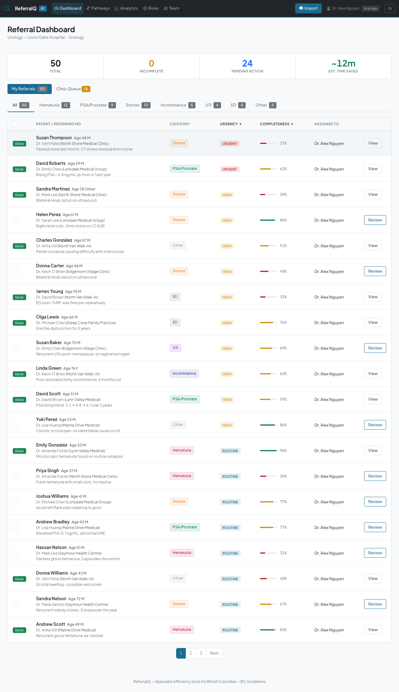
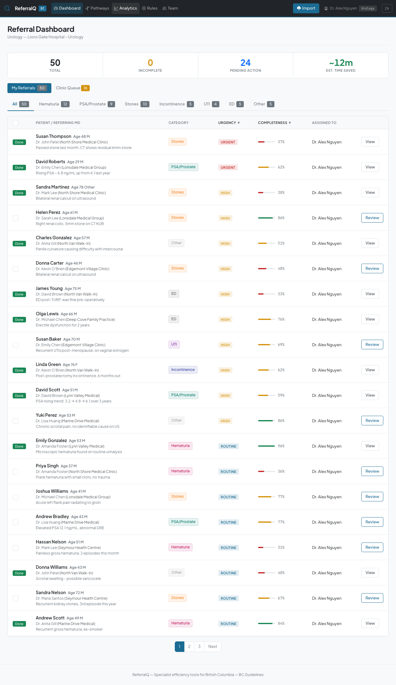
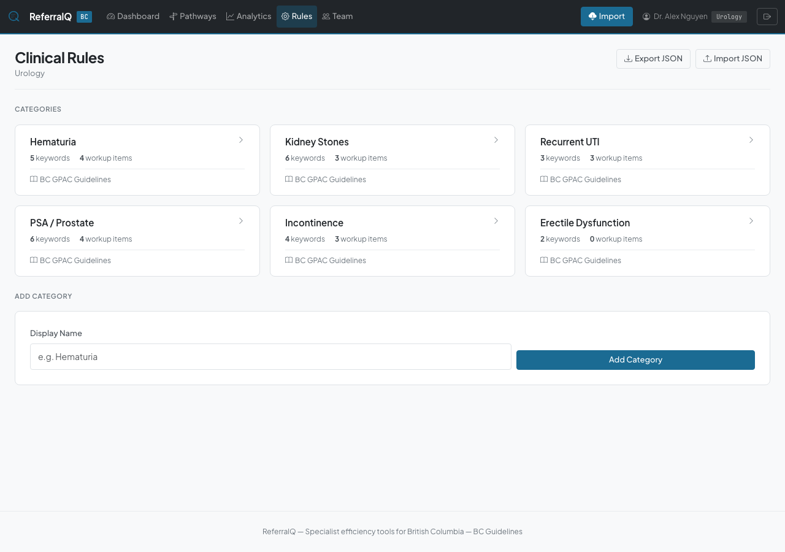
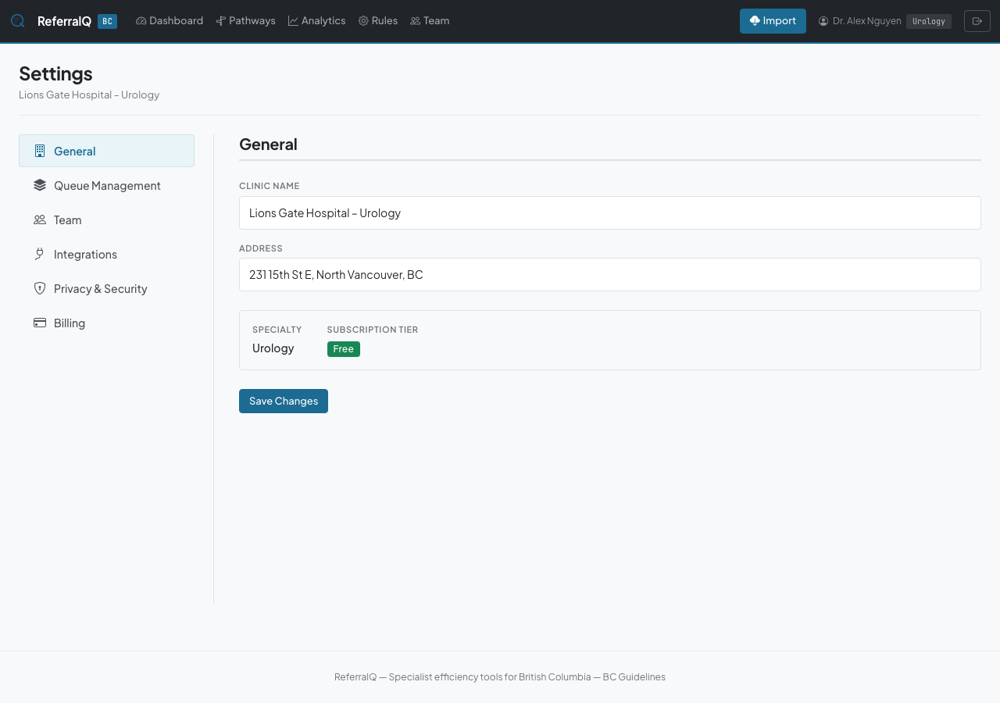
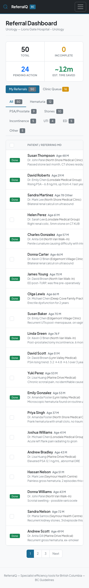

# ReferralQ — UI Screenshots

Visual walkthrough of the specialist referral triage platform.

## Public Pages

### Landing Page
Trust signals, rotating hero, quantitative benefits, and clear CTAs for specialist physicians.

### Login
Clean auth card with brand identity.

### Register
Account creation with password strength indicator, show/hide toggle, and match validation.

## Specialist Dashboard

### Referral Queue
Category-filtered table with sortable columns, priority badges, completeness bars, and assigned-to tracking. 80 demo referrals across 7 urology categories.

### Inline Quick Review
Click any row to expand patient details, triage scores, and action buttons. Accept, request info, or decline directly from the table via AJAX — no page navigation needed.

## Referral Management

### Referral Detail
Full clinical view with patient demographics, referring physician info, clinical notes, triage assessment panel, missing workup detection, and action buttons.

### Send Feedback
Auto-populated feedback form: decision pre-selected from triage, message pre-filled from category-specific templates, recommended workup from missing information.

## Analytics & Configuration

### Analytics Dashboard
Referral volume trends, category distribution, completeness tracking, and outcomes. Time frame picker with MTD/YTD/custom range. Top referring physicians with clinic and specialty.

### Pre-Referral Pathways
Condition-specific workup checklists for family physicians, grouped by specialty. Based on BC/GPAC clinical guidelines.

### Clinical Rules
Category management with auto-generated slugs, classification keywords, workup items, and pathway guidance.

### Settings Hub
Six-section settings with sidebar navigation: General, Queue Management, Team, Integrations, Privacy & Security, Billing.

## Responsive

### Mobile Dashboard
Responsive layout with collapsible nav, stacked stat strip, and scrollable table.

